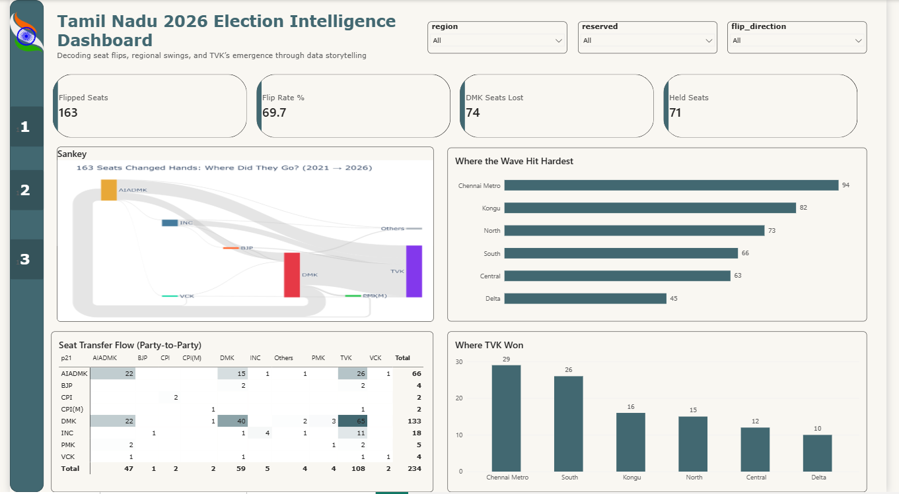
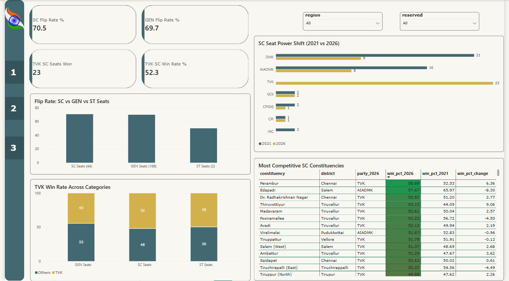
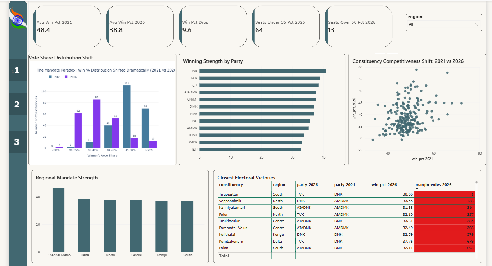

# Tamil Nadu 2026 Election Analysis


A data storytelling project analysing the 2026 Tamil Nadu Assembly Election results for a fictional news network, AtliQ Media. The project answers three research questions (Q2, Q4, Q6) and connects them into one narrative: **a landslide in seats, a fragmented mandate in votes, and it happened equally across every seat category.**

Built using Python for analysis and Sankey visualisation, Power BI for a 3-page interactive dashboard, and Canva for a 10-slide stakeholder pitch deck.

---

## Dashboard Preview

### Page 1: The Great Reshuffle


### Page 2: The Reserved Seat Verdict


### Page 3: The Mandate Paradox


---

## Project Overview

AtliQ Media is producing a one-hour TV show on the 2026 Tamil Nadu Assembly Election. Unlike most channels covering the election with debates and political commentary, AtliQ wants a clean, fact-based show grounded only in ECI data.

As the Data Analyst on this project, the task was to find the most interesting stories in the 2026 results, support each with a clear chart, and pitch them in a way that helps AtliQ plan the show.

**Role:** Data Analyst  
**Tools:** Python (pandas, plotly), Power BI, DAX, Canva  
**Dataset:** Election Commission of India — candidate-level assembly results  
**Scope:** 234 constituencies · 6 regions · 3 seat categories (GEN, SC, ST)  
**Research Questions:** Q2 (Flip Story) · Q4 (Reserved Seats) · Q6 (Margin of Victory)

---

## Key Findings

| Story | Finding |
|---|---|
| The Flip (Q2) | 163 of 234 constituencies (69.7%) changed hands. TVK entered with 0 seats and ended with 108, absorbing from both DMK (65 seats) and AIADMK (26 seats) simultaneously. Chennai Metro flipped 94% of its seats. Delta flipped only 45%. |
| Reserved Seats (Q4) | SC reserved seats flipped at 70.5%. GEN seats flipped at 69.7%. A difference of only 0.8 percentage points. The wave was structurally uniform across all seat categories. TVK won 23 of 44 SC seats — more than DMK and AIADMK combined. TVK's SC win rate (52.3%) was higher than its GEN win rate (44.7%). |
| Margin of Victory (Q6) | Average win share dropped from 48.4% in 2021 to 38.8% in 2026 — a fall of 9.6 percentage points. Seats won with over 50% collapsed from 70 to just 13. Seats won with under 35% rose from 2 to 64. In 1 of every 4 constituencies, most voters chose someone other than the winner. Tightest margin: Tiruppattur — won by exactly 1 vote. |

---

## The One Headline

> *A landslide in seats. A fragmented mandate in votes.*
> *And it happened equally across every seat category.*

This tension — decisive in seat count, fragmented in vote concentration — is what makes the 2026 Tamil Nadu result analytically unusual and what makes it the right story for a data-driven TV show.

---

## Editorial Recommendation for AtliQ Media

**Recommended show structure (35 minutes of data):**

| Segment | Duration | Story | Key Number | Lead Visual |
|---|---|---|---|---|
| The Great Reshuffle | 10 min | 163 of 234 seats changed hands | 69.7% flip rate | Sankey diagram |
| The Reserved Seat Verdict | 10 min | SC and GEN seats flipped identically | 0.8 pp difference | SC seat shift bar |
| The Mandate Paradox | 15 min | Most voters chose someone else in 1 in 4 seats | 1 vote margin | Distribution chart |

**Recommended show opener:** Tiruppattur — won by exactly 1 vote. It is factual, specific, and immediately tells the audience this will not be a typical election show.

**Remaining 25 minutes:** Live Power BI dashboard on screen with anchor filtering by region, reserved category, and year. Every number verifiable from the public record in real time.

---

## Python Analysis Highlights

| Analysis | Technique Used |
|---|---|
| Winners table (2021 and 2026) | sort_values, groupby, first |
| Total valid votes per constituency | groupby, sum, merge |
| Win percentage calculation | vectorised division, round |
| Flip detection | boolean comparison across columns |
| Margin of victory in votes | apply, custom function, second place votes |
| Sankey flow data | groupby, size, filter for flips only |
| Win % distribution buckets | pd.cut, value_counts |
| Correlation: candidates vs win % | corr, scatter |

Full analysis in `notebooks/tn_election_analysis.ipynb`

---

## DAX Measures

Key measures built in Power BI:

- Total Seats, Flipped Seats, Held Seats, Flip Rate %
- SC Flip Rate %, GEN Flip Rate %, TVK SC Win Rate %
- Avg Win Pct 2021, Avg Win Pct 2026, Win Pct Drop
- Seats Under 35 Pct 2026, Seats Over 50 Pct 2026
- DMK Seats Lost, TVK 2026 Seats
- Chennai Metro Avg Win 2026, South Fragmented Seats

Full measures available in the `.pbix` file.

---

## Dashboard Pages

**Page 1: The Great Reshuffle**
4 KPI cards (163 flipped, 69.7% rate, 74 DMK lost, 71 held), Sankey image, regional flip rate bar, seat transfer flow matrix heatmap, TVK wins by region bar, three slicers (region, reserved, flip direction).

**Page 2: The Reserved Seat Verdict**
4 KPI cards (SC flip rate, GEN flip rate, TVK SC seats, TVK SC win rate), SC seat power shift before/after bar, SC vs GEN flip rate comparison, TVK win rate by category stacked bar, most fragmented SC seats table.

**Page 3: The Mandate Paradox**
5 KPI cards (avg win % 2021, avg win % 2026, drop in pp, seats under 35%, seats over 50%), win distribution chart, avg win % by region bar, party avg win % bar, constituency competitiveness scatter plot, tightest electoral victories table.

---

## Data Limitations

| Limitation | Detail |
|---|---|
| 2026 turnout data | Not available from ECI at time of analysis. All margin figures use vote counts only. |
| No demographic data | No caste, religion, gender, or socioeconomic data was used at any point. |
| No causal claims | This analysis describes observable patterns in ECI data only. It makes no claim about why any result occurred. |
| No third-party sources | No exit polls, news articles, opinion surveys, or social media data was used or referenced. |

---

## Project Workflow

1. Downloaded ECI candidate-level results for 2021 and 2026 (constituency_master, tn_2021_results, tn_2026_results)
2. Explored data structure — 4,232 rows (2021), 4,257 rows (2026), 234 constituencies
3. Built winners tables by sorting and groupby first per constituency
4. Calculated total valid votes, win percentages, flip flags, and vote margins
5. Built Sankey flow data filtered to flipped seats only, exported as sankey_flows.csv
6. Built Plotly Sankey diagram and win % distribution chart, exported as PNG
7. Loaded processed CSVs into Power BI, built 3-page dashboard with DAX measures
8. Built 10-slide Canva pitch deck with all charts embedded
9. Recorded 8-minute video walkthrough pitched to AtliQ Media content head

---

## Project Structure

```
tn-election-2026/
│
├── README.md
│
├── notebooks/
│   └── tn_election_analysis.ipynb        # Full reproducible analysis notebook
│
├── data/
│   ├── raw/                              # Original ECI CSV files
│   │   ├── tn_2021_results.csv
│   │   ├── tn_2026_results.csv
│   │   └── constituency_master.csv
│   └── processed/                        # Cleaned and exported outputs
│       ├── constituency_results.csv      # 234 rows, 20 columns, main analysis table
│       ├── sankey_flows.csv              # Seat transition flows for Sankey
│       ├── sankey_tn_2026.png            # Sankey diagram export
│       └── win_distribution.png         # Win % distribution chart export
│
├── dashboard/
│   └── tn_election_2026.pbix             # Full Power BI dashboard file
│
├── deck/
│   └── Tamil_Nadu_2026_RPC_Anshu_Kunwar.pdf  # 10-slide AtliQ Media pitch deck
│
├── vote share/
│   └── party_voteshare.csv               # All candidates both years with vote share
│
└── visuals/
    ├── page1_reshuffle.png               # Dashboard Page 1 screenshot
    ├── page2_reserved.png                # Dashboard Page 2 screenshot
    └── page3_paradox.png                 # Dashboard Page 3 screenshot
```

---

## How to Reproduce

**Python notebook:**
```bash
pip install pandas plotly kaleido openpyxl
```
1. Clone this repo
2. Place raw ECI CSV files in `data/raw/`
3. Open `notebooks/tn_election_analysis.ipynb`
4. Update `output_path` in Cell 7 to your local `data/processed/` folder
5. Run **Kernel → Restart & Run All**
6. Processed files export to `data/processed/` and `vote share/` automatically`

**Power BI dashboard:**
Download [Power BI Desktop](https://powerbi.microsoft.com/desktop/) (free)
→ File → Open → select `dashboard/tn_election_2026.pbix`
→ Update data source path to your local `data/processed/` folder
→ Click Home → Refresh

**Data Source:**
Election Commission of India — candidate-level 2026 Tamil Nadu Assembly Election results.
Non-partisan analysis. No causal claims made.

---

## Skills Demonstrated

Data cleaning and transformation, winners table construction, vote share and margin calculation, flip detection, Plotly Sankey diagram, win percentage distribution analysis, KPI development, DAX measures, Power BI dashboard design (scatter, matrix, heatmap, conditional formatting), data storytelling, stakeholder pitch deck design.

---

## About

**Anshu Kunwar**

[GitHub](https://github.com/Anshukun888) · [LinkedIn](https://linkedin.com/in/anshu-kunwar02) · anshukun777@gmail.com
